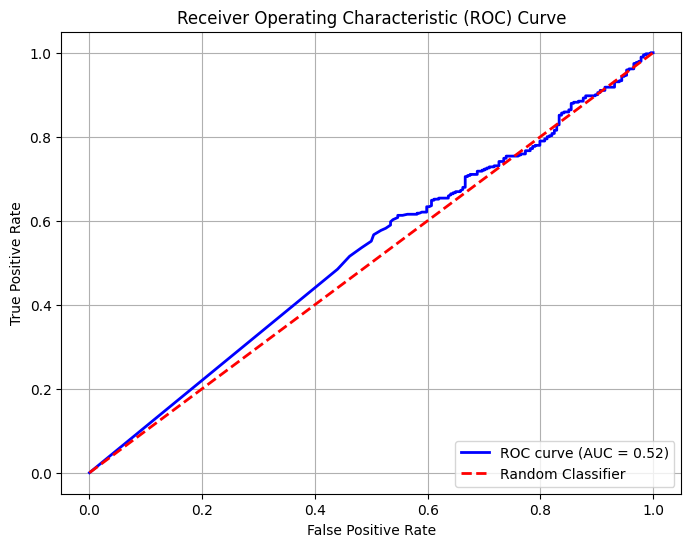

# Pneumonia Detection using a Simple CNN

## Overview
This project demonstrates a deep learning approach to detect pneumonia from chest X-ray images. The solution uses a simple Convolutional Neural Network (CNN) trained on a publicly available dataset to perform a binary classification, distinguishing between healthy and infected lungs.

## Dataset
The model was trained and evaluated on a subset of the **Kaggle Chest X-Ray Images Dataset**, which can be found here: [Chest X-ray Images (Pneumonia)](https://www.kaggle.com/datasets/paultimothymooney/chest-xray-pneumonia). The dataset is structured into three main directories: `train`, `test`, and `val`, each containing subdirectories for the `NORMAL` and `PNEUMONIA` classes.


## Methodology
### Data Preprocessing
Images were prepared for the model using TensorFlow's `ImageDataGenerator`. This involved:
* Rescaling image pixel values to a range of $0$ to $1$.
* Resizing all images to a uniform size of $128 \times 128$ pixels.

### Model Architecture
A simple CNN was constructed with the following layers:
* **Two Convolutional Layers:** These layers use `relu` activation to extract features from the images. Each is followed by a `MaxPooling` layer to downsample the feature maps.
* **Flatten Layer:** This prepares the data for the final classification layers.
* **Dense Layers:** A hidden dense layer with `relu` activation, followed by an output layer with a `sigmoid` activation function for binary classification.

### Training
The model was compiled with the `adam` optimizer and `binary_crossentropy` loss. It was trained for 10 epochs.


## Key Findings & Results
The model was evaluated on an independent test dataset, achieving a solid performance.

* **Final Test Accuracy:** 72.92%
* **Area Under the Curve (AUC):** 0.78

The ROC curve, with an AUC of **0.78**, indicates that the model is performing significantly better than random chance at differentiating between the two classes.


## Project Structure
The dataset and code are organized as follows:

```
├── chest_xray/
│   ├── train/
│   │   ├── NORMAL/
│   │   └── PNEUMONIA/
│   ├── test/
│   │   ├── NORMAL/
│   │   └── PNEUMONIA/
│   └── val/
│       ├── NORMAL/
│       └── PNEUMONIA/
└── pneumonia_detection.py
```

## Libraries Used
* TensorFlow
* Keras
* NumPy
* Matplotlib
* Scikit-learn
